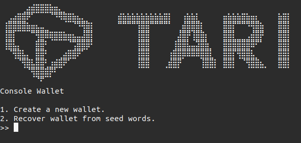
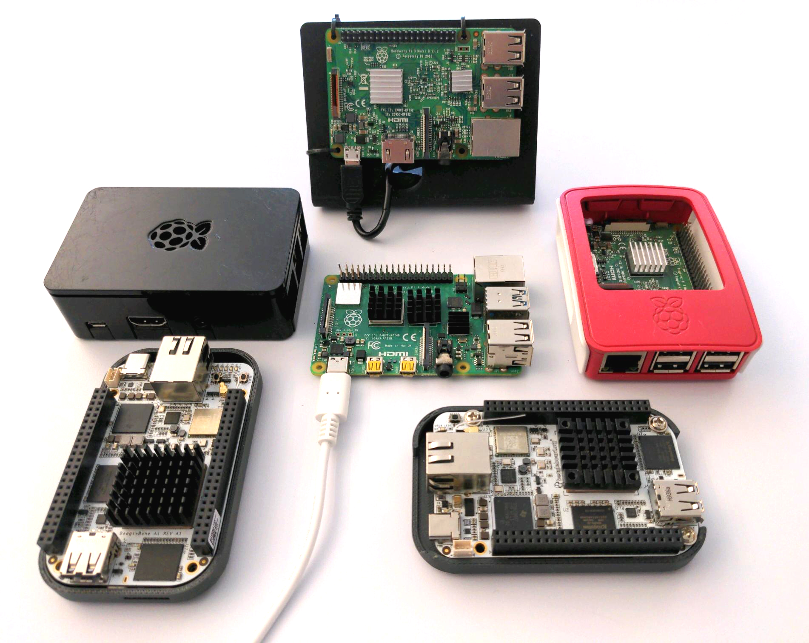
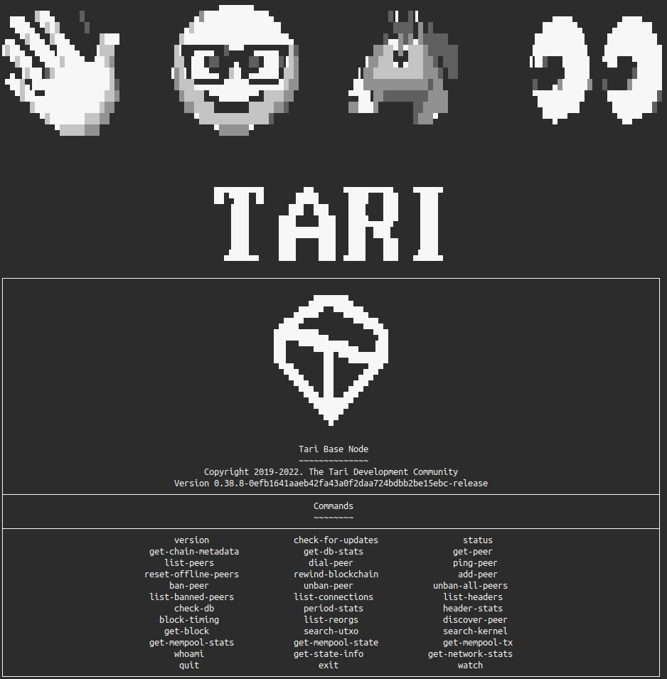

# Running Tari on Open Hardware platforms

[Tari](https://tari.com) is a digital assets focused blockchain protocol that is built in Rust, private by default, and is being architected as a merge-mined sidechain with [Monero](https://monero.org). In a world without default privacy, businesses cannot operate, our personal preferences and histories are sold to the highest bidder, and we lose the ability to conduct our lives in the manner we choose. The Tari community fundamentally believes that privacy-enhancing software should be pervasive and available to all.

The Tari project releases its code as Free and Open Source Software (FOSS) and is designing a codebase that will empower developers of any skill level to quickly build useful applications that leverage the Tari network. The best way to get started is to start running a Tari node. A Tari node is the basic building block of the Tari blockchain and network. Nodes perform the critical functions of maintaining the ledger. Without nodes, there is no network.

This repository is one aspect of the Tari project's dedication to FOSS and Open Hardware platforms. We will provide documentation and guidance here that will be useful for users who intend to run Tari on Open Hardware. Additionally, we will post updates here about Tari proof-of-concepts, testing, and compatibility with hardware such as single-board computers.

**This information is published as a community resource, and the Tari project does not provide hardware support or dedicated help for any of these platforms. We are providing information to be utilized as a community resource.**

## Current Progress

Tari currently runs on a variety of popular platforms such as [Raspberry Pi](https://www.raspberrypi.com) and the [Open Source Hardware](https://www.oshwa.org/definition/) (OSHW) certified [BeagleBone](https://beagleboard.org/bone). It also runs on hardware certified by the Free Software Foundation (FSF) as [Respects Your Freedom](https://ryf.fsf.org) (RYF).

## Hardware
**NOTE:** The Tari project does not provide hardware support or dedicated help for any of these platforms. We are publishing information here as a community resource.

_These platforms are listed in order of known stability running Tari._

* [RYF Thinkpad T500](fsf-ryf/FSF-RYF.md) (x86_64)
* [Raspberry Pi 4 B](raspberry-pi/Raspberry-Pi.md) (arm64)
* [BeagleBone AI-64](beaglebone/BeagleBone.md) (arm64)

_We are currently planning to test Tari on these platforms._
* [Raspberry Pi 3 B+](raspberry-pi/Raspberry-Pi.md) (armhf)
* [BeagleBone AI](beaglebone/BeagleBone.md) (armhf)
* [Precursor](risc-v/RISC-V.md) (riscv64)
* [PINE64 Star64](risc-v/RISC-V.md) (riscv64)

## Licensing

These materials are ethical Free and Open Source Software (FOSS). Any and all original work contained in this repository is copyright &copy; 2022 Tari Labs and released under the BSD 3-Clause License. See [LICENSE](LICENSE) for more information.
