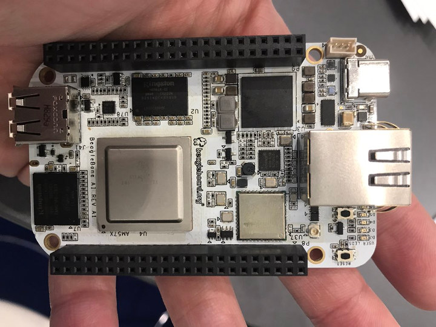
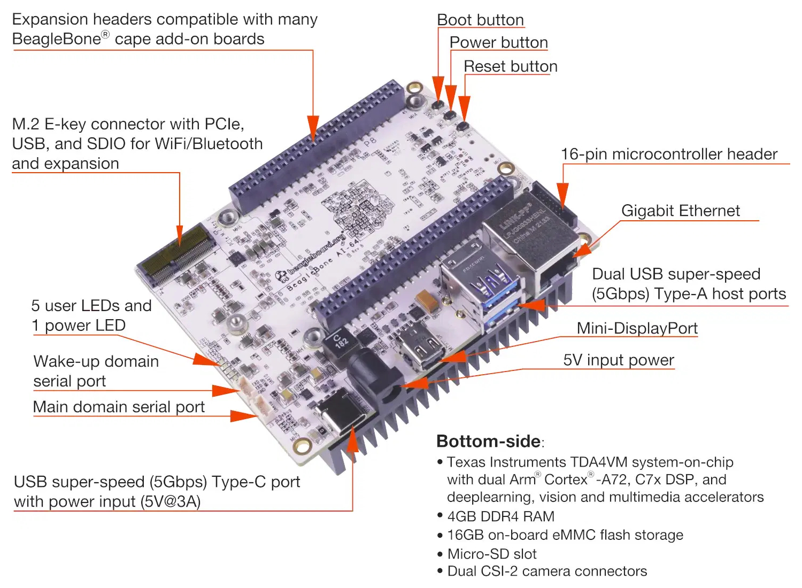
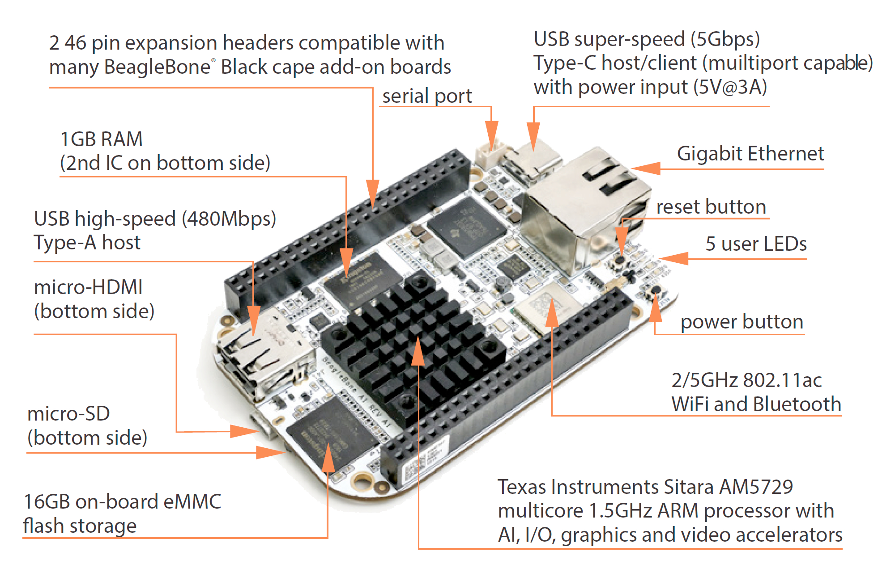
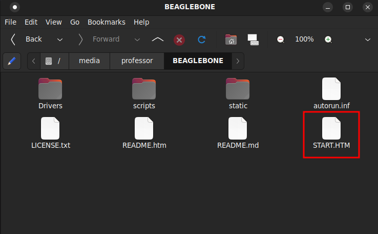
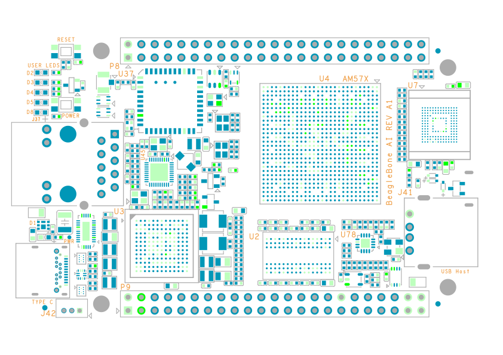

# BeagleBoard.org BeagleBone AI Devices

BeagleBoard AI models are [certified Open Source Hardware](https://certification.oshwa.org/us000169.html) (OSHW). There are two available models of the [BeagleBone AI](https://beagleboard.org/ai): 

* **BeagleBone AI-64:** This small single-board computer has a Texas Instruments TDA4VM chipset (64-bit ARM [arm64](https://wiki.debian.org/Arm64Port) architecture).

* **BeagleBone AI (RevA2):** This smaller single-board computer has a Texas Instruments AM5729 chipset (ARMv7 [armhf](https://wiki.debian.org/ArmHardFloatPort) architecture).

## BeagleBone AI-64

[BeagleBone AI-64](https://beagleboard.org/ai-64) is a single-board computer (SBC) that provides a complete system with development tools for AI/ML. It utilizes the 64-bit Texas Instruments AM5729 SoC and can be expanded with the BeagleBone cape headers, via hundreds of open-source hardware examples and dozens of CoTS expansion options.

### Hardware
* **SoC:** Texas Instruments Jacinto TDA4VM, 2x ARM Cortex-A72
* **Max CPU clock:** 2 GHz
* **Co-processors:** C7x+MMA, 2xC66x, 12xPRU, 6xARM Cortex-R5, PowerVR Rogue 8XE GE8430, H.264 encode, H.264/H.265 decode
* **Analog Pins:** 7 (3.3V)
* **Digital Pins:** 72 (including 7 analog pins which are digital capable)
* **Memory:** 4GB LPDDR4
* **Storage:** 16GB eMMC flash, on-board microSD card slot
* **USB :** USB 3.0 Type-C 5Gbps, 2x USB 3.0 Type-A Host Ports
* **Network:** 1 Gigabit Ethernet M.2, E-key w/ PCIe/USB/SDIO
* **Video:** miniDP, MIPI DSI (w/ I2C), Cape add-on boards
* **Audio:** miniDP, cape/USB add-ons, MikroBUS Shuttle connector
* **Camera:** 2x MIPI CSI (4 lane)
* **Supported Expansion Interfaces:** 4x UART, 16-bit LCD interface, 2x I2C, 2x SPI, 8x PWM, 4x Timer, A/D (3.3V), CAN, Pulse Capture, Quadrature Encoder, PRU GPIO, PRU UART, PRU Pulse Capture
* **On-board Sensors:** On-die processor temperature sensors

### Documentation

#### Vendor

BeagleBoard.org publishes a detailed [git repository](https://git.beagleboard.org/beagleboard/beaglebone-ai-64/-/tree/main/) with all CAD design files as well as a documentation [wiki](https://docs.beagleboard.org/latest/boards/beaglebone/ai-64/).

#### Community

The hardware community around all BeagleBone models is very active on the [BeagleBoard.org forums](https://forum.beagleboard.org). The BeagleBone Google Groups are now [archived](https://forum.beagleboard.org/c/googlegroups/7).

### Software

#### Bootloader

BeagleBone models use the [U-Boot](https://www.denx.de/wiki/U-Boot) bootloader.

#### Operating System

BeagleBone models run a [Debian GNU/Linux](https://debian.org) derivative. Instructions for flashing and updating the OS [are available here](https://docs.beagleboard.org/latest/boards/beaglebone/ai-64/update.html).

#### Connecting to the Device

The system starts the [XFCE](https://xfce.org) desktop environment when it boots. The easiest way to access it is by [connecting the device](https://docs.beagleboard.org/latest/boards/beaglebone/ai-64/ch03.html) via USB-C.

#### Tari Testing &amp; Compatibility

The Tari suite `arm64` builds for [Ubuntu](https://ubuntu.com) will run on the BeagleBoard AI-64.

Some Debian dependencies must be installed:
* [Tor](https://www.linuxcapable.com/how-to-install-tor-browser-on-debian-11-bullseye/) must be installed and the [control port 9051](https://manpages.debian.org/testing/tor/torrc.5.en.html) will need to be open and configured in `/etc/tor/torrc`.
* [unzip](https://packages.debian.org/stretch/unzip) is required to extract the Tari binaries.
* _NOTE_ The Tari suite `start_all` script requires the [GNOME](https://www.gnome.org) desktop environment. This DE is not recommended on this device so the script should be ignored or modified for XFCE.

Instructions: 
* Download the `arm64` build of `tari_suite` from the [Tari downloads page](https://www.tari.com/downloads/).
* Verify the SHA256 checksum for the file.
* Copy the ZIP archive to the device and extract the files with `unzip`.
* Change the permissions on the Tari binaries to be executable.
* Run the Tari binaries via the CLI.

Additional installation instructions are available in the [Tari project repositories](https://github.com/tari-project/tari/blob/development/README.md).

## BeagleBone AI

[BeagleBone AI](https://beagleboard.org/ai) is a miniature single-board computer (SBC) based on the Texas Instruments AM5729. The board is compatible with the BeagleBone Black header and most cape accessories. BeagleBone  AI also has an SoC with TI C66x digital-signal-processor (DSP) and embedded-vision-engine (EVE) cores supported through an optimized TIDL machine learning OpenCL API with pre-installed tools.

### Hardware
* **SoC	:**	Texas Instruments Sitara AM5729, 2x ARM Cortex-A15
* **Max CPU clock:** 1.5 GHz
* **Co-processors:** 2xC66x, 4xPRU, 4xARM Cortex-M4, 4xEVE, 2xPowerVR SGX544, IVA-HD
* **Analog Pins:** 7 (4-wire touchscreen capable) (3.3V)
* **Digital Pins:** 72 (including 7 analog pins which are digital capable)
* **Memory:** 1GB DDR3L
* **Storage:** 16GB eMMC flash, on-board microSD card slot
* **USB:** USB 3.0 Type-C 5Gbps, USB 2.0 Type-A Host Port
* **Network:** 1 Gigabit Ethernet, 2.4/5GHz WiFi, Bluetooth 4.2/BLE
* **Video:** micro HDMI, Cape add-on boards
* **Audio:** micro HDMI, cape/USB add-ons,  Bluetooth
* **Camera:** None
* **Supported Expansion Interfaces:** 4x UART, 16-bit LCD interface, 2x I2C, 2x SPI, 8x PWM, 4x Timer, A/D (3.3V), CAN, Pulse Capture, Quadrature Encoder, PRU GPIO, PRU UART, PRU Pulse Capture
* **On-board Sensors:** On-die processor temperature sensors

### Documentation

#### Vendor
BeagleBoard.org publishes a detailed [git repository](https://github.com/beagleboard/beaglebone-ai) with all [KiCad](https://www.kicad.org/) design files as well as a documentation [wiki](https://github.com/beagleboard/beaglebone-ai/wiki).

#### Community
The hardware community around all BeagleBone models is very active on the [BeagleBoard.org forums](https://forum.beagleboard.org). The BeagleBone Google Groups are now [archived](https://forum.beagleboard.org/c/googlegroups/7).

### Software

#### Bootloader

BeagleBone models use the [U-Boot](https://www.denx.de/wiki/U-Boot) bootloader.

#### Operating System

BeagleBone models run a [Debian GNU/Linux](https://debian.org) derivative. Instructions for flashing and updating the OS [are available here](https://docs.beagleboard.org/latest/boards/beaglebone/ai/ch02.html).

#### Connecting to the Device

The system starts a Web configuration interface when it boots. The easiest way to access it is by [connecting the device](https://docs.beagleboard.org/latest/boards/beaglebone/ai/ch03.html) via USB-C, opening a Web browser, and following the [instructions here](https://beagleboard.org/getting-started#step3).

When you connect to the device, you will be presented with the on-board filesystem as in the screenshot below.  Open `START.htm` in your browser to view instructions for updating the firmware, updating Debian, and other maintenance of the device.

#### Tari Testing &amp; Compatibility

The Tari project does not provide builds for the `armhf` architecture, so the Tari suite must be compiled from source on the BeagleBoard AI.

Instructions for compiling from source are available in the [Tari project repositories](https://github.com/tari-project/tari/blob/development/README.md).

Some Debian dependencies also must to be installed: 
* [Tor](https://www.linuxcapable.com/how-to-install-tor-browser-on-debian-11-bullseye/) must be installed and the [control port 9051](https://manpages.debian.org/testing/tor/torrc.5.en.html) will need to be open and configured in `/etc/tor/torrc`.
* [unzip](https://packages.debian.org/stretch/unzip) is required to extract the Tari binaries.
* _NOTE_: The Tari suite `start_all` script requires the [GNOME](https://www.gnome.org) desktop environment. A GUI is not recommended on this device so the script should be ignored.

