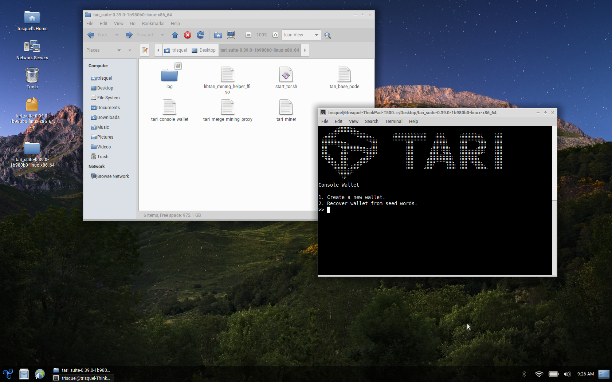

# Free Software Foundation "Respects Your Freedom" Devices

Tari believes in testing on hardware certified by the [Free Software Foundation](https://www.fsf.org) (FSF) as [Respects Your Freedom](https://ryf.fsf.org) (RYF). The RYF certification program encourages the creation and sale of hardware that accomplishes as much as possible to respect freedom, privacy, and control over devices. This means [Free Software](https://en.wikipedia.org/wiki/Free_software) from the BIOS on up.

## Thinkpad T500

Many Lenovo Thinkpad models (often branded IBM) released over the past two decades are certified RYF due to their lack of proprietary firmware requirements and the ability to flash the BIOS with the Free Software replacement [LibreBoot](https://libreboot.org/). Tari is currently testing on the Thinkpad T500 model, but the information below largely applies to all Thinkpad models listed on [this wiki](https://ryf.fsf.org/index.php/categories/laptops).

### Documentation

Information about RYF Thinkpad models is [published by the FSF](https://ryf.fsf.org/index.php/categories/laptops).

### Software

#### Bootloader

The BIOS is [LibreBoot](https://libreboot.org/) on models purchased from [RYF-approved vendors](https://ryf.fsf.org/index.php/categories/laptops) such as Technoethical, Taurinus, and Vikings. Otherwise the BIOS must be [flashed manually](https://libreboot.org/docs/hardware/t500.html).

#### Operating System

Models purchased from [RYF-approved vendors](https://ryf.fsf.org/index.php/categories/laptops) ship with an [Ubuntu](https://ubuntu.com) derivative called [Trisquel GNU/Linux](https://trisquel.info/)

#### Connecting to the Device

The system starts the Trisquel [LXDE](https://lxde.org) desktop environment when it boots.

#### Tari Testing &amp; Compatibility

The Tari suite `x86_64` builds for [Ubuntu](https://ubuntu.com) will run on the Thinkpad T500 with Trisquel.

* **Tested build:** [tari_suite-0.39.0-1b980b0-linux-x86_64.zip](https://tari-binaries.s3.amazonaws.com/current/linux/tari_suite-0.43.1-aecafb8-linux-arm64.zip](tari_suite-0.39.0-1b980b0-linux-x86_64.zip) (November 2022)

#### Getting Started

* Download the `x86_64` build of `tari_suite` for Ubuntu from the [Tari downloads page](https://www.tari.com/downloads/).
* Verify the SHA256 checksum for the file.
* Copy the ZIP archive to the device and extract the files with `unzip`.
* Change the permissions on the Tari binaries to be executable.
* Run the Tari binaries via the CLI.

* _NOTE_ The Tari suite `start_all` script requires the [GNOME](https://www.gnome.org) desktop environment. This DE is not recommended on this device so the script should be ignored or modified for Trisquel.

##### Dependencies

Tor is a dependency for Tari. It is installed on Trisquel by default. [Control port 9051](https://manpages.debian.org/testing/tor/torrc.5.en.html) will need to be open and configured in `/etc/tor/torrc` before the `start_tor.sh` script included with tari will run without errors. You may also run this command in the terminal: 

`tor --allow-missing-torrc --ignore-missing-torrc --clientonly 1 --socksport 9050 --controlport 127.0.0.1:9051 --log "warn stdout" --clientuseipv6 1`

Remember to stop any currently-running instances of the tor daemon before doing so.

##### Tari Base Node

To start the Tari Base Node, execute the `tari_base_node` binary.

Commands: 

* version
* check-for-updates
* status
* get-chain-metadata
* get-db-stats
* get-peer
* list-peers
* dial-peer
* ping-peer
* reset-offline-peersrewind-blockchain
* add-peer
* ban-peer
* unban-peer
* unban-all-peers
* list-banned-peers
* list-connections
* list-headers
* check-db
* period-stats
* header-stats
* block-timing
* list-reorgs
* discover-peer
* get-block
* search-utxo
* search-kernel
* get-mempool-stats
* get-mempool-state
* get-mempool-tx
* whoami
* get-state-info
* get-network-stats
* watch
* quit
* exit

##### Tari Console Wallet

To start the Tari Console Wallet, execute the `tari_console_wallet` binary.

Options: 

1. Create a new wallet.
2. Recover wallet from seed words.

You will be prompted to either create a new wallet and strong password for that wallet or recover an existing wallet from 24 seed words.

* **IMPORTANT:** Keep your wallet seed words in a safe place such as writing them down on paper. They are the only way to recover your wallet and funds and will only be displayed **once**.

##### Tari Miner

To start the Tari Miner, execute the `tari_miner` binary.

Ports 18141, 18142, and 18143 must be open to TCP traffic on `localhost` 127.0.0.1 for the miner to connect to the base node and wallet. These ports will need to be opened in the firewall using, for example, `iptables` or `ufw`. There is no graphical firewall application installed by default on Trisquel. `gufw` can be installed via `apt`: 

`sudo apt-get install gufw`

