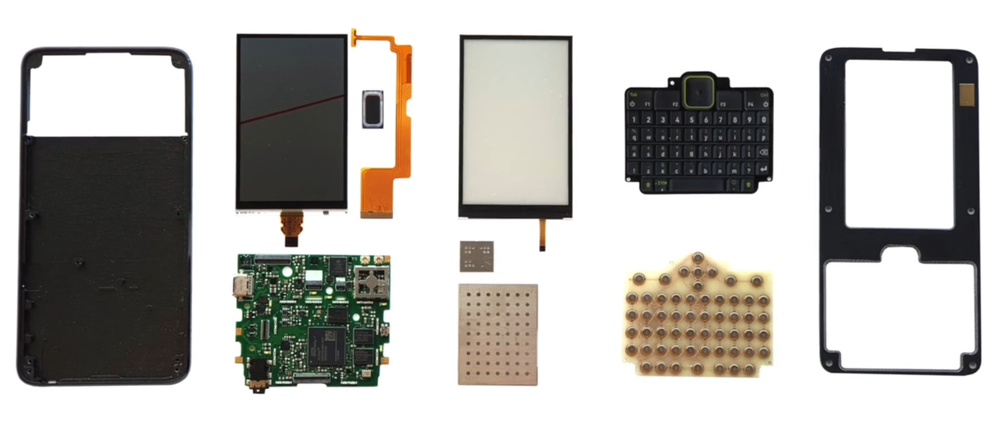
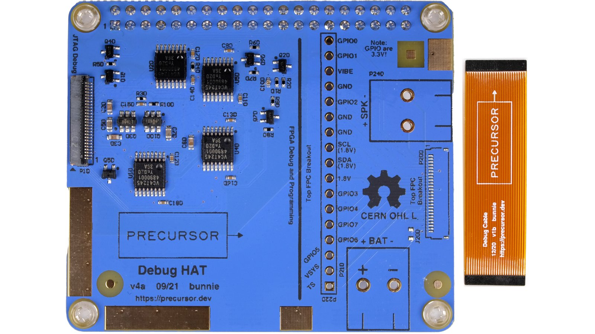

# RISC-V Devices

[RISC-V](https://en.wikipedia.org/wiki/RISC-V) is a free processor architecture provided under Free and Open Source Software (FOSS) licenses that do not require fees to use. Therefore, anyone can manufacture devices utilizing RISC-V without patent and copyright issues associated with other chipset architectures. Two RISC-V devices are of interest to Tari due to their FOSS ecosystems: 

* **Precursor**

* **PINE64 Star64**

Tari has not yet been tested on these devices and will need to be compiled from source for the `risc64` [architecture](https://wiki.debian.org/Ports/riscv64).

## Precursor

[Precursor](https://www.crowdsupply.com/sutajio-kosagi/precursor) is a development platform developed by [Bunnie Huang](https://www.bunniestudios.com/) for secure mobile communication. This pocket-sized device accommodates a built-in display, a physical keyboard, and an internal battery while remaining smaller and lighter than the average smartphone. It is powered by an FPGA-hosted, soft-core System-on-Chip (SoC) and gives developers the freedom to inspect, verify, and customize nearly every aspect of its operation.

### Documentation

Detailed documentation about the Precursor is [available on CrowdSupply](https://www.crowdsupply.com/sutajio-kosagi/precursor).

## PINE64 Star64

Star64 is a RISC-V based Single Board Computer powered by StarFive JH7110 Quad-Core SiFive U74 64-Bit CPU, Imagination Technology BX-4-32 GPU and supports up to 8GB 1866MHz LPDDR4 memory. It provides an eMMC module socket, MicroSD Card slot, PCI-e, Pi-2 Bus, USB 3.0, and many other peripheral interfaces for makers to integrate with sensors and other devices. 

### Documentation

This device has not been released yet, though PINE64 has a large FOSS community and has released RISC-V compatible boards in the past. Documentation is available on the [PINE64 wiki](https://wiki.pine64.org/wiki/STAR64).

